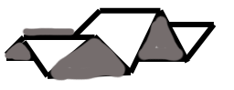
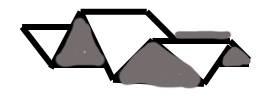
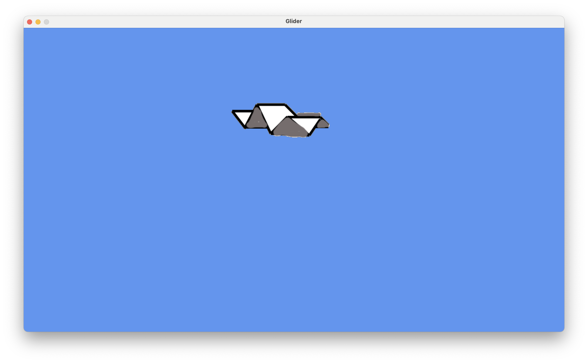
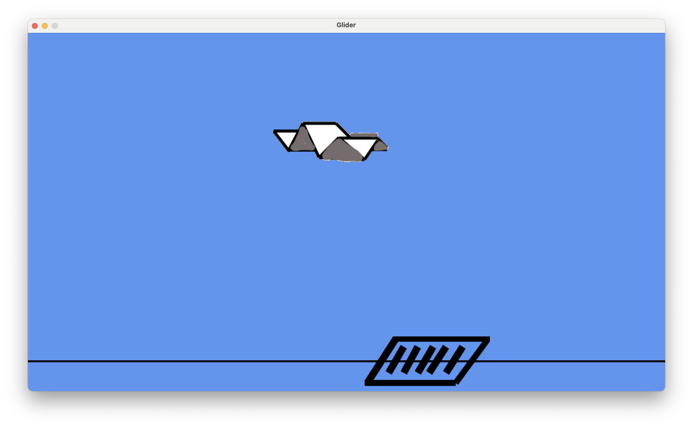

# Glider

In this final project we're gonna make a game similar to the
[Glider Game from 1988](https://www.youtube.com/watch?v=X33q-GT-e5k). 

The goal of this game is to navigate your glider through a series of rooms
and have it exit the house. The force of gravity keeps pulling your glider 
towards the floor, but the vents in the floor give it a push upwards. Your
only control is the left arrow button that slows the glider when it's above 
a vent, allowing it to rise higher than it normally would. There are several
obstacles like shelves, tables, clocks, and the floor itself. Every time your
glider hits one of these obstacles, it loses one 'life.' Each room has coins
that you can collect to get more points.

# 1 Create the basic game

## 1.1 Create a new project

- Create a new project named `glider`
- Just like you did last week with the `hoops` program, 
  go to Settings -> Python Interpreter, and install the `arcade` package.
  - If you can't install the `arcade` package for any reason (like, no internet)
    then just work in the `hoops` package from last week.

## 1.2 Download the sprite images

Download the following three images into your project directory:

- [glider_left.png](../glider_left.png) 
- [glider_right.png](../glider_right.png) 
- [vent.png](../vent.png) 

## 1.3 Create the first version of your app

Create a new file named `glider.py` and copy the following code to it:
```python
"""
Glider Platformer Game

"""
import arcade

# Constants
WINDOW_WIDTH = 1280
WINDOW_HEIGHT = 720
WINDOW_TITLE = "Glider"

# Setting gravity to a really small value because we want the glider to fall gently
GRAVITY = 0.02

# The amount to jump when the glider is over a vent
VENT_JUMP = 3

# How high the floor is from the base of the viewport
FLOOR_Y = 60


```
Make sure you read the comments and understand them. 

Our game will have 4 views:
- `IntroView` - A splash screen before you start the app
- `GameView` - Our main game-playing view
- `GameOverView` - A view that's displayed when you lose all your 'lives'
- `YouWonView` - A view that's displayed when you successfully complete all levels

Now create the GameView class
```python
class GameView(arcade.View):
    """
    Main game-playing view
    """

    def __init__(self):

        # Call the parent class and set up the window
        super().__init__()

        # Load the default texture (image) of the glider 
        # A texture is an image file that's used to display a sprite.
        # A sprite can have many textures, but only displays one at a time.
        self.player_texture = arcade.load_texture("glider_right.png")

        # The main player sprite
        self.glider = arcade.Sprite(self.player_texture)
        
        # Position the sprite near the center of the screen
        self.glider.center_x = 600
        self.glider.center_y = 500

        self.background_color = arcade.csscolor.CORNFLOWER_BLUE

    def setup(self):
        """Set up the game here. Call this function to restart the game."""
        pass

    def on_draw(self):
        """Render the screen."""

        # Clear the screen to the background color
        self.clear()

        # Draw our sprites
        arcade.draw_sprite(self.glider)


```
As always, make sure you read the comments and understand all the code in here. 
Don't hesitate to ask any questions if you don't. 

Finally, add the main function:
```python
def main():
    """ Main function """
    window = arcade.Window(WINDOW_WIDTH, WINDOW_HEIGHT, WINDOW_TITLE)
    start_view = GameView()
    start_view.setup()
    window.show_view(start_view)
    arcade.run()


# This is a common idiom in python
# __name__ is the name of the python module that is being run
# When the current file is run from the command 
# line, __name__ has the value "__main__"
if __name__ == "__main__":
    main()
```

Run the app. If you get any errors, ask for help. 

You should see a screen like this:


You can find the full file as it's supposed to look at the end of this step [here](1.py).

# 2 Working With Textures

## 2.1 Simplify our code

Before we start loading our second texture, let's simplify how we load our 
first texture. We can combine 2 lines of code to 1. In `GameView.__init__`
change these 7 lines
```python
        # Load the default texture (image) of the glider 
        # A texture is an image file that's used to display a sprite.
        # A sprite can have many textures, but only displays one at a time.
        self.player_texture = arcade.load_texture("glider_right.png")

        # The main player sprite
        self.glider = arcade.Sprite(self.player_texture)
```
to 
```python
        self.glider = arcade.Sprite(arcade.load_texture("glider_right.png"))
```
## 2.2 Load the second texture

Then, add the following line _after_ the one you just added above:
```python
        self.glider.append_texture(arcade.load_texture("glider_left.png"))
```

This instructs arcade to associate 2 textures with the `self.glider` sprite. 
The first texture (the one facing right) is number `0` and the second is number 
`1`.

## 2.3 Respond to key presses. 

Add the following simple implementation of `on_key_press` to the bottom
of your GameView class definition (after the `on_draw` method). 

This method relies on the variable `self.glider_direction` to keep track
of which direction the glider is pointing. 
```python
    def on_key_press(self, symbol, modifiers):
        if symbol == arcade.key.RIGHT:
            if self.glider_direction == 'left':
                self.glider_direction = 'right'
                self.glider.set_texture(0)
        elif symbol == arcade.key.LEFT:
            if self.glider_direction == 'right':
                self.glider_direction = 'left'
                self.glider.set_texture(1)
```

## 2.4 Initialize `self.glider_direction`

Since we access `self.glider_direction` we have to make sure it always has a 
valid value. When we start the app, the glider points left, so we set this
variable in `GameView.setup`.

In `GameView.setup` change this line
```python
        pass
```
to
```python
        self.glider_direction = 'right'
```

## 2.5 Define `self.glider_direction`

Finally, add this line to the bottom of `GameView.__init__`. It will define the
`glider_direction` attribute without assigning a direction to it yet. 
```python
        self.glider_direction = None
```
Now, when you run the program the glider will change direction depending on 
which arrow key you press. 

You can find the full file as it's supposed to look at the end of this step [here](2.py).

# 3 Creating our first vent

Vents are special sprites in our game. They affect our `glider` sprite from afar.
Our glider doesn't need to collide with a vent to be affected by its presence. 
Every time our glider is above a vent it gets a vertical push. Because our vents
are special, we won't put them in the sprite list that contains sprites that 
our glider will collide with—we'll create a separate sprite list for vents.

## 3.1 Create our first vent and put it in a SpriteList

Add the following to the bottom of `GameView.__init__`
```python

        # create vents        
        self.vents = arcade.SpriteList()
        v = arcade.Sprite("vent.png")
        v.center_x = 800
        v.center_y = 60
        self.vents.append(v)
```

## 3.2 Draw our vents

Add the following to the bottom of `GameView.on_draw`
```python

        # Draw vents
        self.vents.draw()
```

You should see a screen like this:


You can find the full file as it's supposed to look at the end of this step [here](3.py).

# 4 Our First Obstacle - The Dreaded Floor

Now it's time to create the obstacles that cause us to "lose a life." The first
obstacle is the floor. If the glider touches the floor, we lose a life.

## 4.1 Create the `obstacles` sprite list and add the floor to it

Add the following code to the bottom of `GameView.__init__`. Remember - the 
x location is the location of the _center_ of the floor, so it has a value
of `WINDOW_WIDTH/2`. For now, we'll draw the floor. Later on, we'll make it
transparent. 
```python

        # create the obstacles sprite list
        self.obstacles = arcade.SpriteList()
        
        # create the floor
        floor = arcade.SpriteSolidColor(width=WINDOW_WIDTH, 
                                        height=4,
                                        center_x=WINDOW_WIDTH/2,
                                        center_y=FLOOR_Y,
                                        color=arcade.color.BLACK)
        
        # add the floor to the obstacles list
        self.obstacles.append(floor)
```

## 4.2 Draw the floor

Add the following to the bottom of `GameView.on_draw`
```python
        
        # Draw obstacles
        self.obstacles.draw()
```

You should see a screen like this:


You can find the full file as it's supposed to look at the end of this step [here](4.py).

# 5 Using a Physics Engine

As we saw in our `hoops` app, it gets tedious managing all of the Newtonian physics
even for a simple game. This time we will offload this to the simple
`PhysicsEnginePlatformer` Physics Engine. 

## 5.1 Create the physics engine

Add the following code to the bottom of `GameView.__init__` 

```python

        # create the physics engine
        # don't specify any walls, because every collision is either 'fatal'
        # or a coin-collection
        self.physics_engine = arcade.PhysicsEnginePlatformer(
            self.glider, walls=None, gravity_constant=GRAVITY
        )
```

## 5.2 Let the Physics Engine do its thing

The physics engine will calculate the new state of all sprites depending on all 
the forces acting upon them (including, of course, the force of gravity). Now it's 
time for us to implement `GameView.on_update`. In this method, the physics engine
will update its state. 

Add the following to the bottom of your `GameView` class.

```python

    def on_update(self, delta_time):
        """Movement and Game Logic"""

        # Move the player using our physics engine
        self.physics_engine.update()
```
As you can see, gravity is the only force acting on our glider right now, 
and the glider has no horizontal velocity, so it falls straight down, through the floor.
We'll fix this soon. 

You can find the full file as it's supposed to look at the end of this step [here](5.py).

# 6 Check for Collisions

Now it's time to start checking for collisions and introducing the concepts of
'lives' and 'game over'. 

## 6.1 Initialize the number of lives we have in this game

Add the following to the bottom of `GameView.__init__`
```python

        self.lives = None
```
Then add the following to the bottom of `GameView.setup`
```python
        self.lives = 3
```
## 6.2 Check for Collisions

Now that we have the concept of lives, we need to 'lose a life' every time
the glider collides with something. Add the following to the bottom of 
`GameView.on_update`. 
```python

        # check for collisions
        obstacles_hit = arcade.check_for_collision_with_list(self.glider, self.obstacles)
        
        # if the obstacles_hit list is not empty
        if obstacles_hit:
            self.lose_life()
```

## 6.3 Implement `lose_life`

Every time the glider collides with something the `lose_life` method is called. Now it's
time for us to implement this method. Add the following code to the bottom of the
`GameView` class:
```python

    def lose_life(self):
        if self.lives == 0:
            return
        self.lives -= 1

        if self.lives == 0:
            # if we're down to zero lives left, call game_over()
            self.game_over()
        else:
            self.setup_level()

    def game_over(self):
        print("Game Over")
```

## 6.4 Restart from the starting point

Every time we lose a life we want to start from the beginning location. Eventually,
when we have levels, we want to restart the current level but for now we just want to
make sure we restart at the beginning location. 

Find these lines in `GameView.__init__`. We're gonna move them to a new
method called `GameView.setup_level` that restarts the level
Delete thse lines.
```python

        # Position the sprite near the center of the screen
        self.glider.center_x = 600
        self.glider.center_y = 500
```
Now create a method named `setup_level`. Paste this at the bottom of your `GameView`
class
```python
    def setup_level(self):
        # Position the sprite near the center of the screen
        self.glider.center_x = 600
        self.glider.center_y = 500
        self.glider.change_x = 0
        self.glider.change_y = 0
```
## 6.5 Stop everything if the game is over

Finally, you want the game to not do anything if the game is over. Insert the following
code to the _beginning_ of `GameView.on_update`:

```python
        
        # Don't do anything if the game is over
        if self.lives == 0:
            return
```
So, after this, `GameView.on_update` should look like this:

```python
    def on_update(self, delta_time):
        """Movement and Game Logic"""

        # Don't do anything if the game is over
        if self.lives == 0:
            return

        # Move the player using our physics engine
        self.physics_engine.update()

        # check for collisions
        obstacles_hit = arcade.check_for_collision_with_list(self.glider, self.obstacles)

        # if the obstacles_hit list is not empty
        if obstacles_hit:
            self.lose_life()
```
Now that this is done, you should see that the glider falls 3 times, and then 
the game is over.

You can find the full file as it's supposed to look at the end of this step [here](6.py).

# 7 Moving Forward

We want our glider to move forward at a constant speed. This is easy to do with
our physics engine. Change `self.glider.change_x = 0` to `self.glider.change_x = 3` 
in `GameView.setup_level()`. That's it:

```python
    def setup_level(self):
        # Position the sprite near the center of the screen
        self.glider.center_x = 600
        self.glider.center_y = 500
        self.glider.change_x = 3
        self.glider.change_y = 0
```
You can find the full file as it's supposed to look at the end of this step [here](7.py).

# 8 Cleaning up the Visuals

Now let's clean up the images a bit. First, let's make the floor transparent. 
Add the following line immediately after you create self.floor in `GameView.__init__`

```python
        self.floor.alpha = 0
```
Also in init, add `, scale=0.5` to the line where you create `self.glider`. This scales the glider down, and makes it smaller. 
Similarly, add `, scale=0.3` to the line where you create the vent `v`. 
So now, the `__init__` method should look like this:

```python
    def __init__(self):

        # Call the parent class and set up the window
        super().__init__()

        self.glider = arcade.Sprite(arcade.load_texture("glider_right.png"), scale=0.5)
        self.glider.append_texture(arcade.load_texture("glider_left.png"))

        self.background_color = arcade.csscolor.CORNFLOWER_BLUE
        self.glider_direction = None

        # create vents
        self.vents = arcade.SpriteList()
        v = arcade.Sprite("vent.png", scale=0.3)
        v.center_x = 800
        v.center_y = 60
        self.vents.append(v)

        # create the obstacles sprite list
        self.obstacles = arcade.SpriteList()

        # create the floor
        floor = arcade.SpriteSolidColor(width=WINDOW_WIDTH,
                                        height=4,
                                        center_x=WINDOW_WIDTH/2,
                                        center_y=FLOOR_Y,
                                        color=arcade.color.BLACK)
        floor.alpha = 0

        # add the floor to the obstacles list
        self.obstacles.append(floor)

        # create the physics engine
        # don't specify any walls, because every collision is either 'fatal'
        # or a coin-collection
        self.physics_engine = arcade.PhysicsEnginePlatformer(
            self.glider, walls=None, gravity_constant=GRAVITY
        )

        self.lives = None
```

You can find the full file as it's supposed to look at the end of this step [here](8.py).

# 9 Interacting with the Vents

Now it's time for the glider to interact with the vents. 

## 9.1 Give the glider a boost above the vents

If the glider is above a vent, its `change_y` should be set to a positive number, so it moves up. Eventually, the force of 
gravity in the physics engine will move it back down. 

Add the following to the end of `GameView.__init__`
```python

        # This variable indicates whether the glider is currently over a vent or not
        self.currently_over_vent = False
```
We also want to reset this variable in `setup_level`, so add this to the bottom of `setup_level` 
```python

        self.currently_over_vent = False
```
Then add the following to the bottom of `GliderView.on_update`
```python

        still_over_vent = False
        glider_was_over_vent_before = self.currently_over_vent
        for vent in self.vents:
            # If the glider is above the vent (the distance from the vent's center to the glider's center is 
            # less than the vent's width)
            if abs(vent.center_x - self.glider.center_x) < vent.width:
                self.currently_over_vent = True
                self.glider.change_y = VENT_JUMP  # give the glider a boost
                if not glider_was_over_vent_before:
                    # play the jump sound
                    arcade.sound.play_sound(self.jump_sound)
                still_over_vent = True
                # We don't need to check all vents. Stop after you find one that the glider is over.
                break
                
        # If we get off the vent
        if glider_was_over_vent_before and not still_over_vent:
            self.currently_over_vent = False
            self.glider.change_y = 0  # stop the glider from rising further after it leaves the vent
```
Look over that code, and make sure you understand it. Ask your instructor if you have any questions. You can see that 
the code plays a sound the first time the glider goes over a vent. Let's create that sound now. Add the following lines
to the bottom of `GameView.__init__`
```python

        # sound to be played when we collect a coin
        self.collect_coin_sound = arcade.load_sound(":resources:sounds/coin1.wav") 

        # sound to be played when the glider goes over a vent
        self.jump_sound = arcade.load_sound(":resources:sounds/jump1.wav")
```

## 9.2 Slowing Down over the Vents

Now we need to allow the glider to slow down its horizontal velocity over the vents, 
allowing it to rise higher than normal. The way to do this is to press the left 
arrow key to slow down the movement to the right. We'll also make the glider
oscillate between pointing left and pointing right while it's slowing down - to
give us a visual queue about what's happening. 

Arcade only informs us when a key is pressed or released. We have to keep track of
which key is pressed. We can have more than one key pressed at a time, but for this
game there is only one key that we need to press - the left arrow key. Think 
of this key as a brake. We'll track which key is pressed in a variable 
named `current_key_press`. 

Add the following to the bottom of `GameView.__init__`:

```python

        # track what key is currently being pressed
        self.current_key_press = None

        # track which direction the glider is currently facing
        self.glider_direction = 'right'
```
Then modify `GameView.on_key_press` to look like this:
```python
    def on_key_press(self, symbol, modifiers):
        if symbol == arcade.key.LEFT and self.currently_over_vent:
            # only handle the press of the LEFT arrow key if the glider is over a vent
            self.current_key_press = arcade.key.LEFT
            # Only change the texture if we need to - don't do unnecessary work
            if self.glider_direction == 'right':  # pointing to the right
                self.glider_direction = 'left'
                self.glider.set_texture(1)
```
Then, immediately below that, add `on_key_release`
```python

    def on_key_release(self, symbol, modifiers):
        self.current_key_press = None
        if symbol == arcade.key.LEFT:
            # switch back to the old texture
            self.glider.set_texture(0)
            self.glider_direction = 'right'
```
Now we need to "apply the brakes." This will be done in `GameView.on_update` 
Add the following to to bottom on `GameView.on_update`
```python

        if self.current_key_press == arcade.key.LEFT:
            self.glider.center_x -= self.glider.change_x * 0.9  # apply brakes
            # The physics engine already moved the glider to the right. 
            # Move it 90% of the way back
            
            # swap out the texture
            if self.glider_direction == 'right':
                self.glider_direction = 'left'
                self.glider.set_texture(1)
            else:
                self.glider_direction = 'right'
                self.glider.set_texture(0)
```

You can find the full file as it's supposed to look at the end of this step [here](9.py).

# 10 Slowing down the oscillation

When you run the game you can see that the oscillation is really fast. This is
because we're changing the orientation of the glider in `on_update` which is called 
as often as 30 times a second. So we need to slow it down. Let's try changing the
glider_direction every 4th invocation of `on_update`.

Add the following global variable to the top of your file, under `FLOOR_Y`:
```python

# How many calls to on_update to ignore before switching directions
DIRECTION_DELAY = 4
```
Add the following to the bottom of `GameView.__init__`:
```python

        # How many calls to on_update have we skipped
        self.direction_count = 0
```
Change the following code in `on_update`
```python
            # swap out the texture
            if self.glider_direction == 'right':
                self.glider_direction = 'left'
                self.glider.set_texture(1)
            else:
                self.glider_direction = 'right'
                self.glider.set_texture(0)
```
to
```python
            # swap out the texture
            self.direction_count += 1
            if self.direction_count >= 4:
                # Only swap directions when on every 4th attempt
                self.direction_count = 0
                if self.glider_direction == 'right':
                    self.glider_direction = 'left'
                    self.glider.set_texture(1)
                else:
                    self.glider_direction = 'right'
                    self.glider.set_texture(0)
```
Now the direction change is a lot slower.

You can find the full file as it's supposed to look at the end of this step [here](10.py).

# 11 Coins

To make the game more interesting lets add some coins to the screen and give the player 100 points for every 
coin they collect. 

## 11.1 Create and Initialize the Variables
Add the variable `score` to the bottom of `GameView.__init`. 
```python
        
        # The current score
        self.score = 0

        # The sprite list containing coins
        self.coins = arcade.SpriteList(use_spatial_hash=True)
```
## 11.2 Add a coin to the game
Now add a coin to the game. Add the following to the bottom of `setup_level` 
```python

        coin = arcade.Sprite(":resources:images/items/coinGold.png", scale=0.25)
        coin.center_x = 900
        coin.center_y = 600
        self.coins.append(coin)
```
Then add the following to the end of `GameView.on_draw`
```python

        # Draw coins
        self.coins.draw()
```
## 11.3 Coin-collecting logic
Add the following code to the bottom of `GameView.on_update`
```python

        # Check for collision with coins
        coin_hit_list = arcade.check_for_collision_with_list(self.glider, self.coins)
        
        # Play a sound if we collect one or more coins
        if coin_hit_list:
            arcade.sound.play_sound(self.collect_coin_sound)

        # For each coin we collect, remove it from the sprite list and increase our score by 100
        for coin in coin_hit_list:
            coin.remove_from_sprite_lists()
            self.score += 100
```
 ## Print the score
Add the following import near the top of your file:
```python
from pyglet.graphics import Batch
```

Add the following line to the bottom of `GameView.on_draw`
```python

        # print the score
        self.print_score()
```
And then define the `print_score` function near the bottom of your file:

```python
    def print_score(self):
        batch = Batch()
        text = arcade.Text(f"Score: {self.score}",
                           WINDOW_WIDTH - 10,
                           40,
                           batch=batch,
                           color=arcade.color.BLACK,
                           font_size=18,
                           anchor_x='right')
        batch.draw()
```
You can find the full file as it's supposed to look at the end of this step [here](11.py).

# 12 Obstacles
Let's add an obstacle that the user has to get around (or over). Add the following code to the bottom of `GameView.setup_level`
```python
        shelf = arcade.SpriteSolidColor(75, 10, 1100, 550, arcade.color.BLACK)
        self.obstacles.append(shelf)
```
As you can see, by default the glider will hit the 'shelf.' The only way to avoid it is to hit the left arrow button
when the glider is over the vent, so that the glider glides above the shelf and gets past it.

Let's add the number of lives to the score display as well. Change `print_score` as follows:
```python
    def print_score(self):
        batch = Batch()
        text = arcade.Text(f"Lives: {self.lives} Score: {self.score}",
                           WINDOW_WIDTH - 10,
                           40,
                           batch=batch,
                           color=arcade.color.BLACK,
                           font_size=18,
                           anchor_x='right')
        batch.draw()
```
Now, let's add a sound for when you lose a life. Add the following line to the bottom of `GameView.__init__`
```python

        # Lose a life sound
        self.life_sound = arcade.load_sound(":resources:sounds/explosion2.wav")

        # Game Over sound
        self.game_over_sound = arcade.load_sound(":resources:sounds/gameover5.wav")
```
Now, update lose_life to this:
```python
    def lose_life(self):
        if self.lives == 0:
            return
        self.lives -= 1

        if self.lives == 0:
            # if we're down to zero lives left, call game_over()
            arcade.sound.play_sound(self.game_over_sound)
            self.game_over()
        else:
            arcade.sound.play_sound(self.life_sound)
            self.setup_level()
```
You can find the full file as it's supposed to look at the end of this step [here](12.py).


# 13 Levels
Now that we have the basic game working, let start working on making and editing levels. 

## 13.1 The Level Data Structure
The first thing we need to do is define a data structure that will hold all the
information about a level. What information is this? Well, it's stuff like: 

- What obstacles are there in this level?
- Where are they located?
- How many vents are there, and where are they located?
- What `y` location does the glider start this level at?
- How many coins are in this level, and where are they located?
- What non-obstacle drawings are in this level?
- Are there any images to be displayed in this level?

The simplest data structure to use for this is a dictionary. Let's create a method 
to load the levels, and put this method at the bottom of the `GameView` class:
```python
    def get_levels(self):
        return [
            {
                "glider_y": 500,
                "vent_x": [650, 950],
                "coin_xy": [(384, 300), (640, 350), (900, 500)],
                "shelf_xywh": [],
                "drawing_xywh": [],
                "image_xyp": []
            },
            {
                "glider_y": 200,
                "vent_x": [150, 950],
                "coin_xy": [],
                "shelf_xywh": [],
            },
            {
                "glider_y": 500,
                "vent_x": [300, 850],
                "coin_xy": [(384, 300), (640, 350), (900, 500)],
                "shelf_xywh": [(800, 400, WINDOW_WIDTH / 2, 4)],
                "drawing_xywh": [(800, 230, 2, 340)],
            },
            {
                "glider_y": 500,
                "vent_x": [650, 950],
                "coin_xy": [(384, 300), (640, 350), (900, 500)],
                "shelf_xywh": [],
                "spinner_xywh": [(800, 300, WINDOW_WIDTH / 2, 8)]
            },
        ]
```
You can see that this method returns a list of dictionaries. Not all keys are in 
all dictionaries. So, we should not use direct index access to access a key. That
would throw an Exception if the key isn't in the dictionary. And the app would 
crash. We should
use the `.get` method of a dictionary which returns the specified 
default value (or `None`) if the key isn't in the 
dictionary.

## 13.2 Creating the Instance Variables for the Levels and the Current Level 
Add the following code to the bottom of `GameView.__init__`
```python

        # The current level of the game
        self.current_level = 1
        
        # The data for each level
        self.levels = self.get_levels()
```
## 13.3 Building the Current Level
Now we need to build the level. We're going to do this in the `setup_level` method. 
First, we need to delete all the lines that we currently have in `setup_level`, and
replace them with:
```python
        # Initialize the key state variables
        self.glider.change_x = 3
        self.glider.change_y = 0
        self.currently_over_vent = False
        self.glider.center_x = 0

        # clear all sprite lists
        self.obstacles.clear()
        self.obstacles.append(self.floor)
        self.vents.clear()
        self.coins.clear()
        self.drawings.clear()
        self.images.clear()
        
        # load the data for the current level
        data = self.levels[self.current_level - 1]  # don't forget the -1 here!
        
        # now set the variables based on the data
        self.glider.center_y = data.get("glider_y", 600)  # default center_y is 600
        
        # create the images first, since they're in the background
        for x, y, p in data.get("shelf_xyp", []):  # if this key is not present, iterate over an empty list
            image = arcade.Sprite(p)
            image.center_x = x
            image.center_y = y
            self.images.append(image)   # append each image to the image sprite list
        
        # create the vents
        for x in data.get("vent_x", []):
            v = arcade.Sprite("vent.png", scale=0.3)
            v.center_x = x
            v.center_y = 60
            self.vents.append(v)  # append each vent to the vent sprite list
            
        # create the coins
        for x, y in data.get("coin_xy", []):
            coin = arcade.Sprite(":resources:images/items/coinGold.png", scale=0.25)
            coin.center_x = x
            coin.center_y = y
            self.coins.append(coin)  # append each coin to the coin sprite list
            
        for x, y, w, h in data.get("shelf_xywh", []):
            shelf = arcade.SpriteSolidColor(w, h, x, y, arcade.color.BLACK)
            self.obstacles.append(shelf)   # append each shelf to the shelf sprite list
            
        for x, y, w, h in data.get("drawing_xywh", []):
            drawing = arcade.SpriteSolidColor(w, h, x, y, arcade.color.BLACK)
            self.drawings.append(drawing)   # append each drawing to the drawing sprite list
```
Make sure you understand all the code above. Ask you instructor if you have any questions. 

Now we need to create the two new sprite lists: `drawings` and `images`. Add the following 
code to the bottom of `GameView.__init__`.

```python

        # create the drawings and images sprite lists
        self.drawings = arcade.SpriteList()
        self.images = arcade.SpriteList()
```
Finally, if you've been paying attention, you'll see that after we clear the `obstacles`
sprite list above, we add `self.floor` to it. But in our `__init__` method, `floor` is
a local variable, not an instance variable. So, we need to make it into an instance variable. 

To do that, change these lines in `GameView.__init__`:
```python
        # create the floor
        floor = arcade.SpriteSolidColor(width=WINDOW_WIDTH,
                                        height=4,
                                        center_x=WINDOW_WIDTH / 2,
                                        center_y=FLOOR_Y,
                                        color=arcade.color.BLACK)
        floor.alpha = 0

        # add the floor to the obstacles list
        self.obstacles.append(floor)
```
to
```python
        # create the floor
        self.floor = arcade.SpriteSolidColor(width=WINDOW_WIDTH,
                                             height=4,
                                             center_x=WINDOW_WIDTH / 2,
                                             center_y=FLOOR_Y,
                                             color=arcade.color.BLACK)
        self.floor.alpha = 0

        # add the floor to the obstacles list
        self.obstacles.append(self.floor)
```
If you run the game now, you'll see that you can complete the level, but it doesn't 
take you to the next level. Let's address that now. 

# 13.4 Check for Completion of the Current Level
Add the following code to the bottom of `GameView.on_update`
```python

        # if the glider has gone off the right edge of the screen
        if self.glider.center_x >= WINDOW_WIDTH:
            self.handle_new_level()
```
Then, add the `handle_new_level` method and one more to the bottom of the `GameView` class

```python

    # Update and set up the new level, or display the "you won" message
    def handle_new_level(self):
        if self.current_level == len(self.levels):
            self.you_won()
            return
        self.current_level += 1
        self.setup_level()

    def you_won(self):
        print("You won!")
```
Finally, let's update the `print_score` method so that it prints the current level.

Replace `print_score` with this:
```python
    def print_score(self):
        batch = Batch()
        text = arcade.Text(f"Level: {self.current_level} Lives: {self.lives} Score: {self.score}",
                           WINDOW_WIDTH - 10,
                           40,
                           batch=batch,
                           color=arcade.color.BLACK,
                           font_size=18,
                           anchor_x='right')
        batch.draw()
```

You can find the full file as it's supposed to look at the end of this step [here](13.py).

# 14 Startup and Game Over Views
The game almost looks like a real game, but it's missing a key part: Screens for start-up, 
and for when the game is over - either because you lost all live or because you completed
all levels. Lets work on them now. 

# 14.1 Creating new Views
The best way to create these screens is not to add the text to the `GameView`, but to 
create new a new view for each of the screens.

Create these three new views and add them near the bottom of your file, after the 
`GameView` class but before `main`.

```python

class StartupView(arcade.View):
  def on_show_view(self):
    """ This is run once when we switch to this view """
    self.window.background_color = arcade.color.DARK_CHESTNUT

  def on_draw(self):
    """ Draw this view """
    self.clear()
    batch = Batch()
    text_1 = arcade.Text("Welcome to GliderJETS!",
                         self.window.width / 2,
                         self.window.height / 2,
                         batch=batch,
                         color=arcade.color.WHITE,
                         font_size=50,
                         anchor_x='center')

    text_2 = arcade.Text("Press any Key to Start",
                         self.window.width / 2,
                         self.window.height / 2 - 75,
                         batch=batch,
                         color=arcade.color.WHITE,
                         font_size=50,
                         anchor_x='center')

    batch.draw()

  def on_key_press(self, symbol, modifiers):
    """ If the user presses the mouse button, start the game. """
    start_view = GameView()
    start_view.setup()
    start_view.setup_level()
    self.window.show_view(start_view)


class GameOverView(arcade.View):
  def on_show_view(self):
    """ This is run once when we switch to this view """
    self.window.background_color = arcade.csscolor.DARK_SLATE_BLUE

  def on_draw(self):
    """ Draw this view """
    self.clear()
    batch = Batch()
    text_1 = arcade.Text("Game Over",
                         self.window.width / 2,
                         self.window.height / 2,
                         batch=batch,
                         color=arcade.color.WHITE,
                         font_size=50,
                         anchor_x='center')

    text_2 = arcade.Text("Press any Key to Restart",
                         self.window.width / 2,
                         self.window.height / 2 - 75,
                         batch=batch,
                         color=arcade.color.WHITE,
                         font_size=50,
                         anchor_x='center')

    batch.draw()

  def on_key_press(self, symbol, modifiers):
    """ If the user presses the mouse button, start the game. """
    start_view = GameView()
    start_view.setup()
    start_view.setup_level()
    self.window.show_view(start_view)


class YouWonView(arcade.View):
  def on_show_view(self):
    """ This is run once when we switch to this view """
    self.window.background_color = arcade.csscolor.DARK_SLATE_BLUE

  def on_draw(self):
    """ Draw this view """
    self.clear()
    batch = Batch()
    text_1 = arcade.Text("You Made It!",
                         self.window.width / 2,
                         self.window.height / 2,
                         batch=batch,
                         color=arcade.color.WHITE,
                         font_size=50,
                         anchor_x='center')

    batch.draw()

  def on_key_press(self, symbol, modifiers):
    """ If the user presses the mouse button, start the game. """
    start_view = GameView()
    start_view.setup()
    start_view.setup_level()
    self.window.show_view(start_view)
```
You can see that these views are pretty similar to each other, but they display different
things. Later we'll see how to refactor this code to use only one view for all screens.

For now we need to make sure we're showing these views at the correct time. 

# 14.2 Showing the new views

Change `main` to contain this code:
```python
def main():
    """ Main function """
    window = arcade.Window(WINDOW_WIDTH, WINDOW_HEIGHT, WINDOW_TITLE)
    # show the start-up view instead of jumping straight to the game
    start_view = StartupView()
    window.show_view(start_view)
    arcade.run()
```
Now, let's update the `GameView.game_over` method to the following:
```python
    def game_over(self):
        game_over_view = GameOverView()
        self.window.show_view(game_over_view)
```
And update `GameView.you_won` to:
```python
    def you_won(self):
        you_won_view = YouWonView()
        self.window.show_view(you_won_view)
```
You can find the full file as it's supposed to look at the end of this step [here](14.py).

```python
```

```python
```

```python
```

```python
```

```python
```

```python
```

```python
```

```python
```

```python
```

```python
```

```python
```

```python
```

# 15 Spinners

```python
```

```python
```

```python
```

```python
```

```python
```

```python
```

```python
```

# 16 Where To Go From Here

```python
```

```python
```

```python
```

```python
```

```python
```

```python
```

```python
```

```python
```

```python
```
